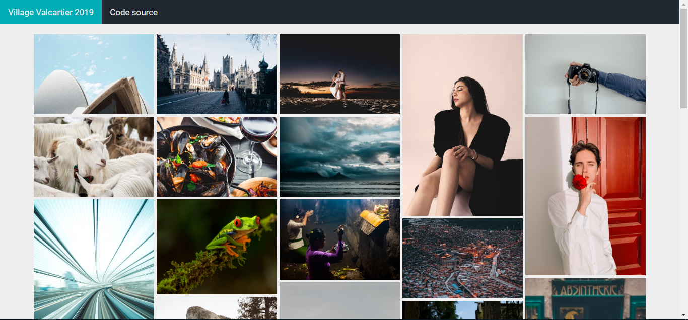

# WWW2019
Photos de la sortie au Villages Valcartier

## Installation des outils

Entrez sur le navigateur file:///[RACINE]/public_html/index.html

Les images sont stockées dans images/sortie. 

**A chaque modifications de ce dossier, taper la commande `sh generate_html.sh`**

